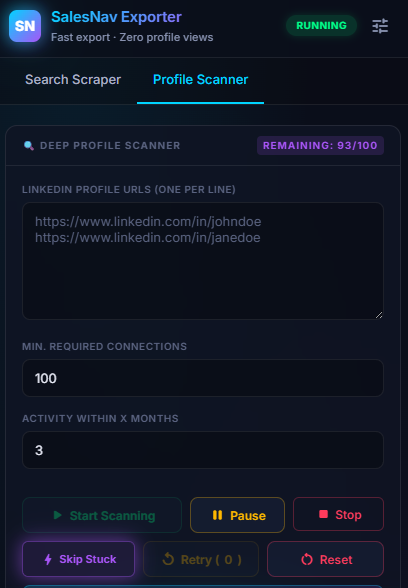
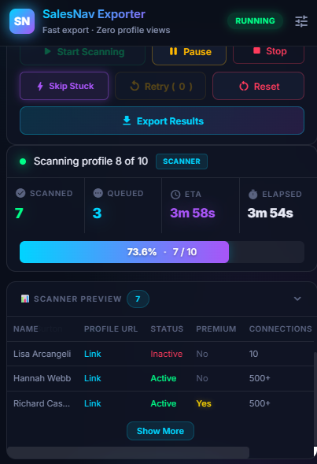
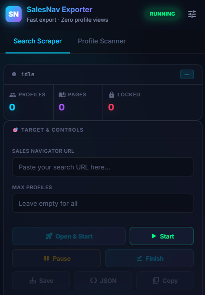
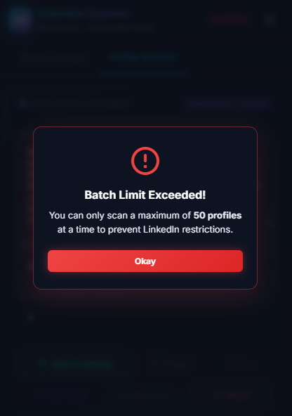

# 🚀 SalesNav Exporter

**A complete LinkedIn Sales Navigator scraping solution with both a browser extension and a cloud-based scraping dashboard.**

---

## 📁 Project Structure

This repository contains two independent components:

### 1. 🔌 Browser Extension (`/browser-extension`)
A Chrome extension for extracting leads directly from LinkedIn Sales Navigator and analyzing LinkedIn profiles for recent activity.

**Features:**
- 📊 List Exporter — Export leads from Sales Navigator search/lists
- 🔍 Deep Scanner — Profile activity checker with CSV export
- Works directly in the browser without external servers

**Installation:** See [browser-extension/README.md](browser-extension/README.md)

### 2. ☁️ Cloud Scraper Dashboard (`/website`)
A Next.js web application with a full scraping dashboard accessible from any browser.

**Features:**
- 🔍 Sales Navigator Search Export — Lead & Company search scraping
- 👤 Profile Scanner — Batch profile analysis with activity detection
- 🗺️ Google Maps Scraper — Business data extraction with Apify-compatible schema
- Real-time streaming progress, CSV/JSON export, pagination

**Tech Stack:** Next.js 16, React 19, TypeScript, Puppeteer

**Installation:** See [website/README.md](website/README.md)

---

## 📸 Browser Extension Preview

  
  
  
  

---

## ⚠️ Disclaimer

Use responsibly. Excessive automation may trigger LinkedIn account restrictions. This tool is for internal use only.
