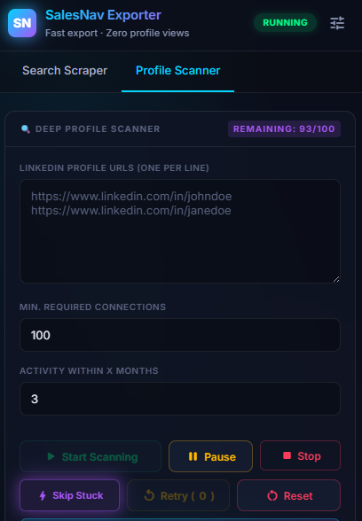
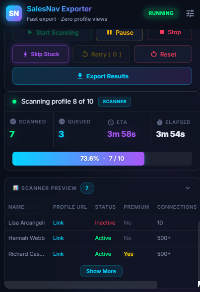
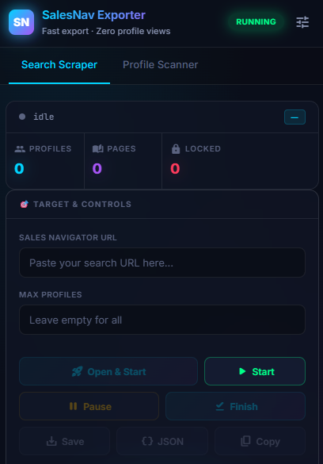
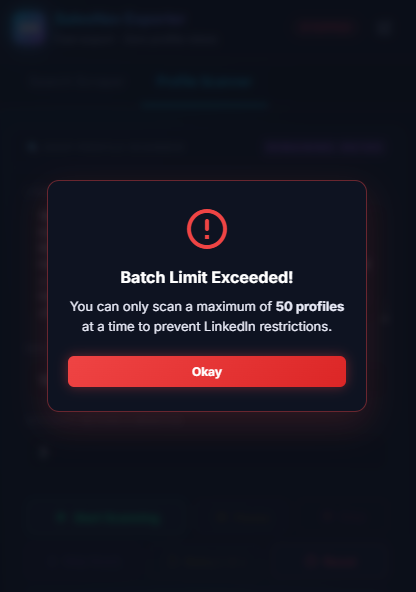

# 🚀 SalesNav Exporter (Chrome Extension)

**A lightweight Chrome extension for extracting leads and scanning profile activities directly from LinkedIn Sales Navigator.**

---

## 🌟 Features

- 📊 **List Exporter** — Export leads & accounts from Sales Navigator search and lead/account lists directly to CSV.
- 🔍 **Deep Scanner** — Automated profile activity inspector (posts, comments, reactions) to identify active vs inactive leads.
- ⚡ **Client-Side & Secure** — Runs directly in your browser using your active session. No external servers or credential sharing.

---

## 📥 Installation

1. Clone or download this repository.
2. Open Chrome and navigate to `chrome://extensions/`.
3. Enable **Developer mode** (top-right toggle).
4. Click **Load unpacked** and select the `browser-extension` folder.

---

## 📸 Extension Preview

  
  
  
  

---

## ⚠️ Disclaimer

Use responsibly. Excessive automation may trigger LinkedIn account restrictions. This tool is for internal use only.
